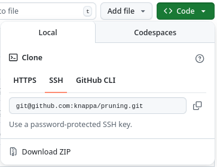

# Phylogenetic trees: Maximum likelihood estimation of branch lengths and rate parameters, using Felsenstein's pruning algorithm

Description

## Installation

### Getting the code

The code for this project is available from our github repository at [https://github.com/knappa/pruning](https://github.com/knappa/pruning). From this page, one can either download a zip file of the project directory or use git to obtain the same information.
  * To download a zip file of the directory, click on the green "Code" button shown below. Then the dialog shown will appear with its "Download ZIP" link. Click the link to download 
  
    
  * To check out a local copy of the repository using git, open the command line and move to the directory you wish to place the project in. Then run either

```commandline
git clone https://github.com/knappa/pruning.git
```
or
```commandline
git clone git@github.com:knappa/pruning.git
```
  These are equivalent except for how they authenticate with github.

### Install pruning into a virtual environment

Once you have your copy of the project, we recommend that you install it into a virtual environment to manage dependencies without conflicts with other packages on your system. We suggest placing the virtual environment into a subdirectory of the project. To do this:
```commandline
cd pruning
python3 -m virtualenv venv
```
This creates a subdirectory `venv` inside the project's root directory. (You can name it whatever you want except for the names of existing directories; if you choose another name, substitute that name for `venv` in all instructions that follow.) To enter/activate the virtual environment, run
```commandline
source venv/bin/activate
```
while in the project root directory. Typically, entering the virtual environment will change the command prompt, adding some text (e.g. `(venv)`) to the prompt. You will need to repeat this step on every time you open a new command prompt/shell. To deactivate the virtual environment, type `deactivate`.

To install the pruning package inside the virtual environment, make sure that you have entered the virtual environment and are in the project's root directory. Then run 
```commandline
python3 -m pip install --upgrade pip
python3 -m pip install -e .
```
The first line is optional, but newish versions of pip complain when they are not at the latest version and this command updates pip and removes the error. These commands should install a collection of dependencies as well as the pruning package itself. If there are no errors reported, you can test the installation further by running 
```commandline
pruning --help
```
which should output documentation on the command line options for the newly installed pruning utility from this package. 

## Usage

3 utilities
pruning            pruning_halfstack  pruning_stack

### pruning

The pruning utility has a number of options. 

#### Required options

* `--seqs` sequence file in Phylip format
* `--tree` the true tree in Newick format (branch lengths are not required and are ignored for optimization purposes)
* `--model` choice of model for to optimize. There are several options
  * `DNA` a GTR4 model
  * `PHASED_DNA16` a GTR4$^{\oplus 2}$ model. i.e. a model on phased DNA (16 state) in which the maternal and paternal strands evolve independently according to the same GTR4 model.
  * `PHASED_DNA16_MP` a GTR4$\oplus$GTR4 model. i.e. a model on phased DNA (16 state) in which the maternal and paternal strands evolve independently according to (possibly distinct) GTR4 models.
  * `UNPHASED_DNA` a model of unphased maternal/paternal DNA (10 state) obtained by lumping phased maternal/paternal pairs to unphased pairs. e.g. A|C and C|A are identified with the unphased pair A/C   
  * `CELLPHY` another model on unphased DNA (10 state) as described in TODO: cite
  * `GTR10` the general time reversible model on 10 states, applied to unphased DNA. State order: AA, CC, GG, TT, AC, AG, AT, CG, CT, GT.
  * `GTR10Z` a submodel of `GTR10` in which the rates of all double-transitions (e.g. the rates of AA$\to$CC or CT$\to$AG) are fixed at zero. Note that both the `UNPHASED_DNA` and `CELLPHY` models are submodels of `GTR10Z`.

**Data requirements** 
* The taxon names for leaves in the phylip and newick files must match. 
* For the phased and unphased models, the phylip file should contain sequences as space delimited pairs. For the phased (16 state) models, the ordering of each pair is maternal then paternal and, for the unphased (10 state) models, the ordering of the pairs is ignored. 

#### Optional options

* `--ambig` set the choice of an ambiguity character for sequences. Default: ?
* `--output` prefix for output files that will hold optimization results
* `--overwrite` if present, pruning will overwrite existing output files. otherwise, if the output files already exist, pruning will exit
* `--log` if present, print various diagnostic and intermediate convergence results during optimization
* Rate normalization options; these also affect the reported branch lengths. It only makes sense to use one or zero of these options.
  * `--ploidy` normalize $\mu$ for haploid (1) or diploid (2) , default is to infer ploidy from the chosen model.
  * `--final_rp_norm` instead of normalizing using $\mu$, normalize rate parameters so that the final one is fixed at 1. (In the DNA model this corresponds to the G$\to$T rate and is different in each model.)
* Rate parameter options. These are mutually exclusive.
  * `--freq_params_from_seq` Default. Frequency parameters are derived directly from the sequence.
  * `--optimize_freq_params` Initial frequency parameters are derived from the sequence, but then treated as an optimizable parameter.
  * `--fix_freq_params[4,10,16]` Frequency parameters are fixed as input.


command line options for each and their purpose

## Included scripts